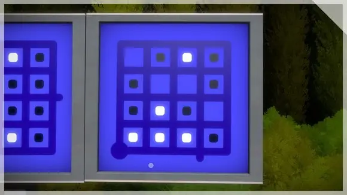
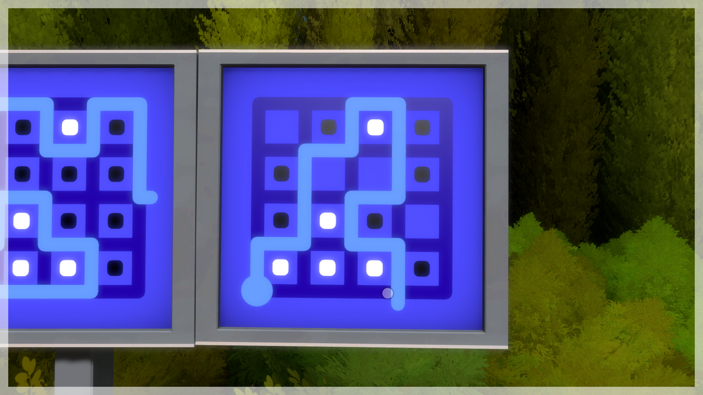

# Project
This project is a 2D version of the maze-like puzzles seen in [The Witness](https://store.steampowered.com/app/210970/The_Witness/).
The project consists of a Level editor and the game itself as interactive GUI apps made using a game development library.

# Short examples to show what the game is about
In this game the starting points of the maze are big circles and the goals are rounded dead ends in the maze. The game has a few basic maze puzzles, but most of the puzzles in the game are more about the symbols that are in between the maze lines. In this project I will call the light-colored spots where symbols can be placed "cells". For example the following maze can be solved by segregating the squares of different color in different "rooms" with the line.  
  
This is the solution to that maze. The colors need to be separated only from other cells in the maze and not the outer edge of the maze.  

# Programming language
I chose [Nim](nim-lang.org) for this project. Nim is much better suited for games than Python, because its much faster than Python and has good libraries for games. Nim is syntactically quite close to Python with type annotations, but there are big differences outside of syntax. Standard Nim code is mostly readable and understandable to Python programmers. Other than Nim, I understand Python, Lua or C# code (out of these my C# skills are the weakest).

# Used algorithms and data structures
The levels will be represented by objects (C-like structs) which contain at least the following things:  
 - Undirected graph with the line drawing, start and end points
 - A hash set of used symbols (could be useless depending on the way to store symbol locations)
 - Symbol locations (maybe as an undirected graph of the maze cells or a hash table with pairs of location and symbol)  
Note: The levels will need to be serialized on disk, so keep that in mind when changing the data structures.  

The game state will be stored in an object that includes at least the following things:  
 - A hash table with a coordinate as a key and an order number as value. This will be used to store the line that the player is drawing.
 - An undirected graph with the maze cells and symbols contained in them 

In the game each of the symbols adds its own logic to the mazes. The most important algorithms in this project are the ones used to implement maze solution checking and the symbols. [Here](https://thewitness.fandom.com/wiki/Puzzle_elements) are the rules of the game. Most of them are extremely simple to implement as an algorithm and not really worth describing in detail here.  

These are some of the most important algorithms used:
 - Separating the cells into "rooms" based on the player's line. Similar to [this](https://cses.fi/tira22k/task/2329) algorithms and data structures excercise, but in this case the walls aren't explicit graph nodes. Because of that the algorithm might end up being completely different.
 - An algorithm that solves the [exact cover problem](https://www.wikiwand.com/en/Exact_cover). It will be used for checking the solution for [blocks/tetris pieces](https://thewitness.fandom.com/wiki/Puzzle_elements#Blocks). This project can use a really naive algorithm because there are very few tetris pieces in a single maze and the area that needs to be covered is very small in most cases. (I can add an example maze like in the short examples section if this isn't clear)
 - Different algorithms that check the number and color of the symbols in a given room. These will be used to check for example the colored squares in the image examples.
 - Simple algorithms that operate on the player's line

# Inputs to program and basic program behavior
The level editor program can be used to create levels and save them on disk. To save the level object it will be serialized first. The game program loads levels from disk and deserializes them back into the object described above. The level is drawn on screen and the maze solution is checked when the player draws a line from a starting point to a goal.

# Expected time and space complexities
The algorithm that separates maze cells into rooms should have linear time and space complexity. The exact cover algorithm used can be any decently optimized non-polynomial algorithm, because it is an NP-complete problem. The algorithm doesn't have to be as fast as [Knuth's algorithm X](https://www.wikiwand.com/en/Knuth%27s_Algorithm_X), because in this game only 1 solution needs to be found. Most of the algorithms checking symbols that depend on the player's line can be constant time and space complexity. However these are just optimal time complexities for these algorithms. Most important for the game is that the maze solution can be checked in less than one frame (16 ms) so the game can instantly tell the player whether the solution was correct or not.

# Sources
I will use the original game (linked at the top) for reference. There is also a [browser-based clone of the game's mazes](https://windmill.thefifthmatt.com/) that I might use for reference. Its source code can be found [here](https://github.com/thefifthmatt/windmill-client).

# Degree/study programme
I'm a computer science bachelor student.

# Language used in the project
The weekly reports are in Finnish and everything else is in English.
